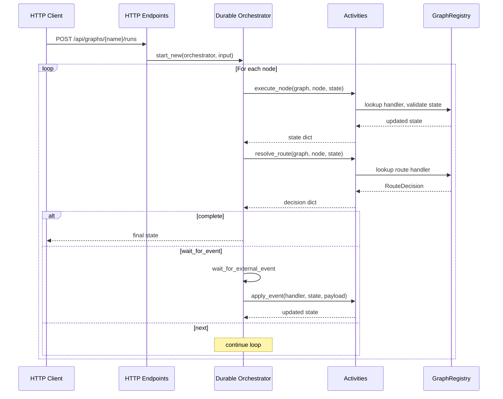
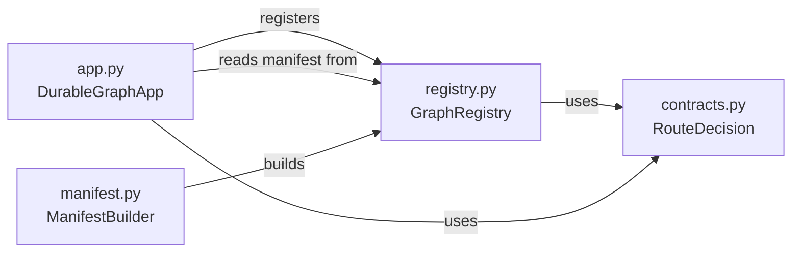

# Architecture

`azure-functions-langgraph` compiles graph-shaped workflows into Azure Functions
applications that run on Durable Functions without violating orchestrator determinism.

## Design principles

- Keep the orchestrator deterministic — all user logic runs in activities.
- Use a manifest as a stable, versioned intermediate representation.
- Separate graph definition from runtime execution.
- Favor typed state contracts over ad-hoc dict passing.
- Avoid global mutable configuration.

!!! tip "Mental model"
    The manifest is compiled once at startup. The orchestrator reads it to
    decide what activities to call, but never executes user code directly.

## High-level flow



## Runtime rule

The orchestrator may only:

- read the manifest
- read orchestration input
- set custom status
- call activities
- wait for external events
- decide loop termination from activity outputs

The orchestrator may not:

- call LLMs
- call tools
- inspect wall-clock time
- perform network I/O
- run arbitrary route logic

## Execution loop

```text
state = initial_state
node = entrypoint

while True:
  state = call execute_node(graph_name, node, state)
  decision = call resolve_route(graph_name, node, state)

  if decision.action == "complete":
    return state

  if decision.action == "wait_for_event":
    event_payload = wait_for_external_event(decision.event_name)
    state = call apply_event(graph_name, decision.event_handler_name, state, event_payload)
    node = decision.resume_node
    continue

  node = decision.next_node
```

## Module responsibilities

### `app.py` (runtime entry point)

Owns:

- `DurableGraphApp` class
- HTTP endpoint registration (start run, get status, send event, cancel, health, openapi)
- Durable Functions orchestrator definition
- Activity definitions (execute_node, resolve_route, apply_event)

Not responsible for:

- graph definition or manifest building
- state validation logic

### `manifest.py` (graph definition)

Owns:

- `ManifestBuilder` fluent API
- `GraphManifest` data structure
- `GraphRegistration` data class
- `NodeDefinition` model
- Topology hash computation

### `registry.py` (handler dispatch)

Owns:

- `GraphRegistry` for storing and looking up registrations
- `execute_node` — state validation, handler invocation, state merge
- `resolve_route` — route handler invocation and decision normalization
- `apply_event` — event handler invocation and state merge

### `contracts.py` (data types)

Owns:

- `RouteAction` enum
- `RouteDecision` model with factory methods
- `OrchestrationInput`, `NodeExecutionRequest`, `RouteResolutionRequest`, `EventApplyRequest`
- `RunStatusEnvelope`

## Module boundaries



### What this package owns

| Concern | Description |
| --- | --- |
| Graph compilation | Compile node/edge definitions into a versioned manifest |
| Runtime orchestration | Deterministic Durable Functions orchestrator loop |
| State management | Pydantic v2 state validation and merge semantics |
| HTTP API | Start, poll, event, cancel, health, and OpenAPI endpoints |
| Handler dispatch | Node, route, and event handler invocation |

### What this package does not own

- LLM client management or prompt engineering
- Authentication and authorization
- Business/domain logic inside node handlers
- Data persistence beyond Durable Functions state
- Automatic LangGraph translation (future roadmap)

## Why a manifest exists

A manifest gives the runtime a stable, versioned intermediate representation:

- graph name and version
- topology hash for change detection
- state model identity
- entrypoint and node definitions
- handler name references
- event handler registrations

This makes safe deployment and debugging easier than trying to infer graph
structure at runtime from arbitrary objects.

## Versioning shape

The hash is derived from a canonical JSON representation of the graph topology.
Breaking graph changes should eventually deploy side-by-side with older manifests
still available for in-flight instances.

## Storage stance

Durable state is the execution source of truth.
Long-term memory belongs in pluggable providers.

## Invariants and guarantees

- `ManifestBuilder.build()` requires an entrypoint referencing a registered node.
- Terminal nodes cannot define `next_node` or `route_handler_name`.
- The orchestrator never calls user code directly.
- State merging is shallow for dict returns, full replacement for BaseModel returns.
- Route handlers can return `RouteDecision`, `str`, `dict`, or `None`.

## Anti-patterns to avoid

| Anti-pattern | Why it causes problems |
| --- | --- |
| Calling LLMs inside the orchestrator | Breaks Durable Functions replay determinism |
| Skipping state model validation | State drift across nodes becomes hard to debug |
| Using mutable global state in handlers | Activity instances may run on different workers |
| Deep nesting of graph nodes | Increases orchestration history size and replay cost |

## Related pages

- [Usage](usage.md)
- [Configuration](configuration.md)
- [API Reference](api.md)
- [Troubleshooting](troubleshooting.md)
