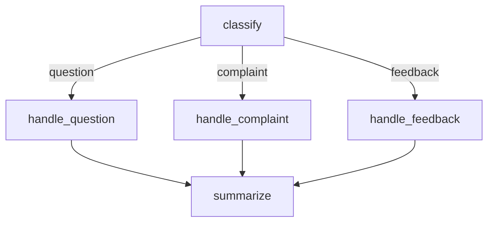

# Content Classifier Example

This example demonstrates **conditional routing** — a `classify` node inspects
the input and a route handler directs execution to one of several specialised
handlers, all without external events.

## Overview

The content classifier graph:

1. **Classifies** the input text by category and sentiment
2. **Routes** to the appropriate handler based on category
3. **Handles** the content with a specialised response
4. **Summarizes** the result



## State Model

```python
from pydantic import BaseModel


class ContentState(BaseModel):
    text: str
    category: str | None = None
    sentiment: str | None = None
    response: str | None = None
    summary: str | None = None
```

## Node Handlers

### classify

Determines category and sentiment from the input text:

```python
def classify(state: ContentState) -> dict:
    lower = state.text.lower()

    if "?" in state.text or any(w in lower for w in ("how", "what", "why", "when")):
        category = "question"
    elif any(w in lower for w in ("broken", "terrible", "worst", "complaint", "angry")):
        category = "complaint"
    else:
        category = "feedback"

    positive = {"great", "good", "love", "excellent", "thanks"}
    negative = {"bad", "broken", "terrible", "worst", "angry", "hate"}
    words = set(lower.split())
    if words & negative:
        sentiment = "negative"
    elif words & positive:
        sentiment = "positive"
    else:
        sentiment = "neutral"

    return {"category": category, "sentiment": sentiment}
```

### route_after_classify

Uses `RouteDecision.next()` to direct execution based on category:

```python
from azure_functions_durable_graph import RouteDecision


def route_after_classify(state: ContentState) -> RouteDecision:
    handler_map = {
        "question": "handle_question",
        "complaint": "handle_complaint",
        "feedback": "handle_feedback",
    }
    target = handler_map.get(state.category or "", "handle_feedback")
    return RouteDecision.next(target)
```

### Specialised handlers

Each handler generates a category-appropriate response:

```python
def handle_question(state: ContentState) -> dict:
    return {
        "response": (
            "Thank you for your question. Our team will research this "
            "and get back to you within 24 hours."
        ),
    }


def handle_complaint(state: ContentState) -> dict:
    return {
        "response": (
            "We're sorry to hear about your experience. A support specialist "
            "has been assigned to resolve this issue."
        ),
    }


def handle_feedback(state: ContentState) -> dict:
    return {
        "response": "Thank you for your feedback! We appreciate you taking the time to share.",
    }
```

### summarize

Combines all fields into a final summary:

```python
def summarize(state: ContentState) -> dict:
    return {
        "summary": (
            f"Category: {state.category} | Sentiment: {state.sentiment} | "
            f"Response: {state.response}"
        ),
    }
```

## Graph Definition

```python
from azure_functions_durable_graph import ManifestBuilder, RouteDecision

builder = ManifestBuilder(
    graph_name="content_classifier",
    state_model=ContentState,
    version="0.1.0",
    metadata={"example": True, "profile": "routing"},
)
builder.set_entrypoint("classify")
builder.add_node("classify", classify, route=route_after_classify)
builder.add_node("handle_question", handle_question, next_node="summarize")
builder.add_node("handle_complaint", handle_complaint, next_node="summarize")
builder.add_node("handle_feedback", handle_feedback, next_node="summarize")
builder.add_node("summarize", summarize, terminal=True)

registration = builder.build()
```

## Running the Example

Wire it into your `function_app.py`:

```python
from azure_functions_durable_graph import DurableGraphApp
from examples.content_classifier.graph import registration

runtime = DurableGraphApp()
runtime.register_registration(registration)
app = runtime.function_app
```

### Start a run — question

```bash
curl -X POST http://localhost:7071/api/graphs/content_classifier/runs \
  -H "Content-Type: application/json" \
  -d '{"input": {"text": "How do I reset my password?"}}'
```

### Start a run — complaint

```bash
curl -X POST http://localhost:7071/api/graphs/content_classifier/runs \
  -H "Content-Type: application/json" \
  -d '{"input": {"text": "This product is terrible and broken"}}'
```

### Check status

```bash
curl http://localhost:7071/api/runs/{instance_id}
```

Expected final state (for a question):

```json
{
  "state": {
    "text": "How do I reset my password?",
    "category": "question",
    "sentiment": "neutral",
    "response": "Thank you for your question. Our team will research this and get back to you within 24 hours.",
    "summary": "Category: question | Sentiment: neutral | Response: Thank you for your question. Our team will research this and get back to you within 24 hours."
  }
}
```

## Key Patterns Demonstrated

- **Conditional routing**: `route_after_classify` picks different nodes based on state
- **Fan-in topology**: multiple handler nodes converge to a single `summarize` node
- **RouteDecision.next()**: simple programmatic routing without external events
- **State enrichment**: each node adds specific fields while preserving existing state
