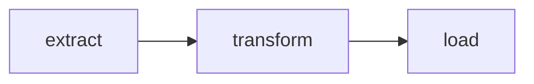

# Data Pipeline Example

This example demonstrates the simplest graph topology: a **sequential pipeline**
with three nodes chained via `next_node`.

## Overview

The data pipeline simulates an ETL (Extract, Transform, Load) workflow:

1. **Extract** — fetches raw records from a source
2. **Transform** — cleans and normalizes each record
3. **Load** — writes the processed records to a destination



## State Model

```python
from pydantic import BaseModel, Field


class PipelineState(BaseModel):
    source_url: str
    raw_records: list[dict] = Field(default_factory=list)
    transformed_records: list[dict] = Field(default_factory=list)
    load_result: str | None = None
    record_count: int = 0
```

## Node Handlers

### extract

Simulates fetching records from an external source:

```python
def extract(state: PipelineState) -> dict:
    raw = [
        {"id": 1, "name": "  Alice  ", "score": "85"},
        {"id": 2, "name": "  Bob  ", "score": "92"},
        {"id": 3, "name": "  Carol  ", "score": "78"},
    ]
    return {"raw_records": raw, "record_count": len(raw)}
```

### transform

Cleans whitespace and casts types:

```python
def transform(state: PipelineState) -> dict:
    transformed = [
        {
            "id": r["id"],
            "name": str(r["name"]).strip(),
            "score": int(r["score"]),
        }
        for r in state.raw_records
    ]
    return {"transformed_records": transformed}
```

### load

Writes processed records to the destination:

```python
def load(state: PipelineState) -> dict:
    count = len(state.transformed_records)
    return {
        "load_result": f"Loaded {count} records to {state.source_url}/output",
    }
```

## Graph Definition

```python
from azure_functions_durable_graph import ManifestBuilder

builder = ManifestBuilder(
    graph_name="data_pipeline",
    state_model=PipelineState,
    version="0.1.0",
    metadata={"example": True, "profile": "etl"},
)
builder.set_entrypoint("extract")
builder.add_node("extract", extract, next_node="transform")
builder.add_node("transform", transform, next_node="load")
builder.add_node("load", load, terminal=True)

registration = builder.build()
```

## Running the Example

Wire it into your `function_app.py`:

```python
from azure_functions_durable_graph import DurableGraphApp
from examples.data_pipeline.graph import registration

runtime = DurableGraphApp()
runtime.register_registration(registration)
app = runtime.function_app
```

### Start a run

```bash
curl -X POST http://localhost:7071/api/graphs/data_pipeline/runs \
  -H "Content-Type: application/json" \
  -d '{"input": {"source_url": "https://example.com/data"}}'
```

### Check status

```bash
curl http://localhost:7071/api/runs/{instance_id}
```

Expected final state:

```json
{
  "state": {
    "source_url": "https://example.com/data",
    "raw_records": [
      {"id": 1, "name": "  Alice  ", "score": "85"},
      {"id": 2, "name": "  Bob  ", "score": "92"},
      {"id": 3, "name": "  Carol  ", "score": "78"}
    ],
    "transformed_records": [
      {"id": 1, "name": "Alice", "score": 85},
      {"id": 2, "name": "Bob", "score": 92},
      {"id": 3, "name": "Carol", "score": 78}
    ],
    "load_result": "Loaded 3 records to https://example.com/data/output",
    "record_count": 3
  }
}
```

## Key Patterns Demonstrated

- **Sequential chaining**: nodes connected with `next_node` for linear execution
- **State accumulation**: each node adds to the state without overwriting previous fields
- **Terminal node**: the final `load` node is marked `terminal=True` to end the graph
