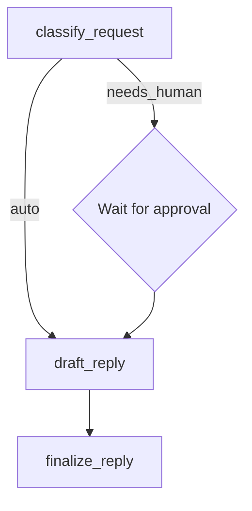

# Support Agent Example

This example demonstrates a human-in-the-loop support agent workflow with
conditional routing and external event handling.

## Overview

The support agent graph:

1. **Classifies** the user's request and tags it
2. **Routes** based on whether human approval is needed
3. **Waits** for external approval if the request involves refunds or legal issues
4. **Drafts** a response based on the classification and approval status
5. **Finalizes** the response with reviewer attribution



## State Model

```python
from pydantic import BaseModel, Field


class SupportState(BaseModel):
    user_message: str
    needs_human: bool = False
    approved: bool | None = None
    reviewer: str | None = None
    draft_response: str | None = None
    final_response: str | None = None
    tags: list[str] = Field(default_factory=list)
```

## Node Handlers

### classify_request

Analyzes the user message and determines if human review is needed:

```python
def classify_request(state: SupportState) -> dict:
    text = state.user_message.lower()
    tags = sorted(set(state.tags) | {
        "refund" if "refund" in text else "general",
    })
    return {
        "needs_human": "refund" in text or "legal" in text,
        "tags": tags,
    }
```

### route_after_classify

Conditional routing based on classification:

```python
def route_after_classify(state: SupportState) -> RouteDecision:
    if state.needs_human and state.approved is not True:
        return RouteDecision.wait_for_event(
            event_name="approval",
            resume_node="draft_reply",
            note="awaiting human approval",
        )
    return RouteDecision.next("draft_reply")
```

### draft_reply and finalize_reply

Generate and finalize the response:

```python
def draft_reply(state: SupportState) -> dict:
    if state.needs_human and not state.approved:
        return {"draft_response": "Your request requires manual review."}
    if "refund" in state.tags:
        return {"draft_response": "We have queued your refund review."}
    return {"draft_response": "Thanks for reaching out."}


def finalize_reply(state: SupportState) -> dict:
    suffix = f" Reviewer: {state.reviewer}." if state.reviewer else ""
    return {"final_response": f"{state.draft_response}{suffix}".strip()}
```

## Graph Definition

```python
from azure_functions_durable_graph import ManifestBuilder

builder = ManifestBuilder(
    graph_name="support_agent",
    state_model=SupportState,
    version="0.1.0",
    metadata={"example": True, "profile": "approval"},
)
builder.set_entrypoint("classify_request")
builder.add_node("classify_request", classify_request, route=route_after_classify)
builder.add_event_handler("approval", merge_approval_event)
builder.add_node("draft_reply", draft_reply, next_node="finalize_reply")
builder.add_node("finalize_reply", finalize_reply, terminal=True)

registration = builder.build()
```

## Running the Example

Wire it into your `function_app.py`:

```python
from azure_functions_durable_graph import DurableGraphApp
from examples.support_agent.graph import registration

runtime = DurableGraphApp()
runtime.register_registration(registration)
app = runtime.function_app
```

### Start a run

```bash
curl -X POST http://localhost:7071/api/graphs/support_agent/runs \
  -H "Content-Type: application/json" \
  -d '{"input": {"user_message": "I need a refund for order #1234"}}'
```

### Send approval event

When the orchestration pauses for approval:

```bash
curl -X POST http://localhost:7071/api/runs/{instance_id}/events/approval \
  -H "Content-Type: application/json" \
  -d '{"approved": true, "reviewer": "alice@example.com"}'
```

### Check final status

```bash
curl http://localhost:7071/api/runs/{instance_id}
```

Expected final state includes:

```json
{
  "state": {
    "user_message": "I need a refund for order #1234",
    "needs_human": true,
    "approved": true,
    "reviewer": "alice@example.com",
    "draft_response": "We have queued your refund review.",
    "final_response": "We have queued your refund review. Reviewer: alice@example.com.",
    "tags": ["refund"]
  }
}
```

## Key Patterns Demonstrated

- **Conditional routing**: `route_after_classify` picks different paths based on state
- **External events**: `wait_for_event` pauses orchestration until human input arrives
- **Event handlers**: `merge_approval_event` processes external event payload into state
- **State merging**: each handler returns partial updates merged into the state model
