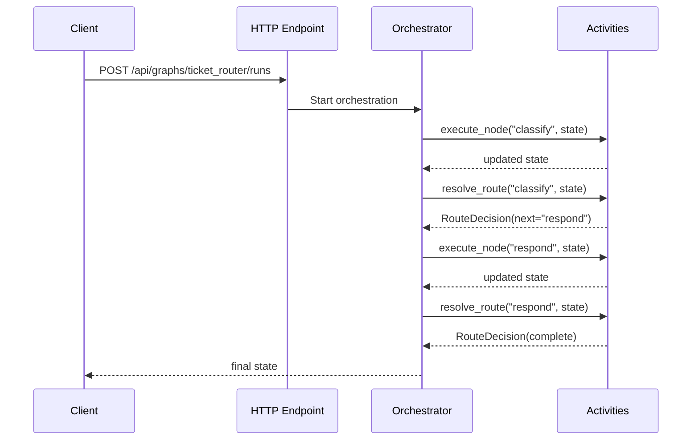

# Getting Started

This quickstart walks you from zero to a running graph-powered Azure Functions
application in a few minutes.

By the end, you will have:

- a graph definition with two nodes
- a Durable Functions orchestrator that executes the graph
- HTTP endpoints for starting runs and polling status

!!! tip "Who this is for"
    This page is for teams using the Azure Functions Python v2 programming model
    (`func.FunctionApp()` and decorators) with Durable Functions.

## Prerequisites

Before starting, make sure you have:

1. Python 3.10 or newer.
2. An Azure Functions Python v2 app structure with Durable Functions extension.
3. Dependencies installed:
   - `azure-functions`
   - `azure-functions-durable`
   - `azure-functions-durable-graph`
   - `pydantic` v2.

See [Installation](installation.md) for version details.

!!! warning "host.json"
    Your `host.json` must include the Durable Functions extension bundle. See the
    `host.json` in the project root for a working example.

## Step 1: Define your state model

Create a Pydantic model that represents the state flowing through your graph:

```python
from pydantic import BaseModel


class TicketState(BaseModel):
    user_message: str
    category: str | None = None
    response: str | None = None
```

## Step 2: Define node handlers

Each node is a function that receives the current state and returns updates:

```python
def classify(state: TicketState) -> dict:
    text = state.user_message.lower()
    category = "billing" if "invoice" in text else "general"
    return {"category": category}


def respond(state: TicketState) -> dict:
    return {"response": f"Handling your {state.category} request."}
```

## Step 3: Build the graph manifest

Use `ManifestBuilder` to declare the graph topology:

```python
from azure_functions_durable_graph import ManifestBuilder

builder = ManifestBuilder(graph_name="ticket_router", state_model=TicketState)
builder.set_entrypoint("classify")
builder.add_node("classify", classify, next_node="respond")
builder.add_node("respond", respond, terminal=True)

registration = builder.build()
```

## Step 4: Create the Function App

Wire the registration into `DurableGraphApp`:

```python
from azure_functions_durable_graph import DurableGraphApp

runtime = DurableGraphApp()
runtime.register_registration(registration)
app = runtime.function_app
```

Save this as `function_app.py` — the standard entry point for Azure Functions Python v2.

## Step 5: Run your app locally

Start your Azure Functions host as you normally do for local development:

```bash
func start
```

The following endpoints will be available:

- `POST /api/graphs/ticket_router/runs`
- `GET /api/runs/{instance_id}`
- `GET /api/health`
- `GET /api/openapi.json`

## Step 6: Test with `curl` (start a run)

```bash
curl -i -X POST http://localhost:7071/api/graphs/ticket_router/runs \
  -H "Content-Type: application/json" \
  -d '{"input": {"user_message": "I need help with my invoice"}}'
```

The response includes Durable Functions status URLs for polling the run.

## Step 7: Check run status

Use the `statusQueryGetUri` from the start response, or:

```bash
curl -i http://localhost:7071/api/runs/{instance_id}
```

Expected response:

```json
{
  "instance_id": "...",
  "runtime_status": "Completed",
  "output": {
    "graph_name": "ticket_router",
    "state": {
      "user_message": "I need help with my invoice",
      "category": "billing",
      "response": "Handling your billing request."
    }
  }
}
```

## Step 8: Understand the execution flow



## Next steps

- Read [Configuration](configuration.md) to learn all `ManifestBuilder` options.
- Read [Usage](usage.md) for advanced patterns like conditional routing and events.
- Explore the [Support Agent Example](examples/support_agent.md).
- Check [API Reference](api.md) for complete signatures.
